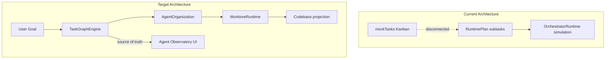

# AgentOS — Gap Analysis

Current implementation status mapped against the [future-state PRD](PRD.md). This document is updated as pillars move from partial to complete.

**Legend:** ✅ Exists · ⚠️ Partial · ❌ Missing

---

## Summary Matrix

| # | Pillar | Status | Maturity |
|---|--------|--------|----------|
| 1 | Project Planning | ⚠️ Partial | UI + types + mock plan |
| 2 | Task Graph Engine | ⚠️ Partial | TaskGraphEngine + executor; UI partially wired |
| 3 | Agent Organization | ⚠️ Partial | Full agent loop + governance modes (Sprint 6–8) |
| 4 | Worktree Runtime | ⚠️ Partial | Create + merge + remove (Sprint 8); push/cleanup at scale deferred |
| 5 | Execution Timeline | ⚠️ Partial | Durable store + hydrate; sessions still simulated |
| 6 | Replay Engine | ❌ Missing | UI placeholders only |
| 7 | Human Governance | ⚠️ Partial | Governance modes enforced at runtime (Sprint 8); audit/replay integration deferred |
| 8 | Approval Gates | ⚠️ Partial | Merge gate wired to real git (Sprint 8); escalation re-run + file-delete gates deferred |
| 9 | Multi-Model Runtime | ⚠️ Partial | Inference + planner (S5); builder/reviewer execution |
| 10 | Skills Framework | ⚠️ Partial | Static catalog |
| 11 | Persistent Agent Memory | ❌ Missing | — |
| 12 | Testing & Verification | ⚠️ Partial | Test-writer agent runs tests on graph (Sprint 7); coverage gates deferred |
| 13 | Cost Accounting | ⚠️ Partial | Mock counters in UI |
| 14 | Local First | ⚠️ Partial | Tauri-first + SQLite store (Sprint 1); orchestrator not hydrated |
| 15 | Agent Observatory | ⚠️ Mostly exists | Comprehensive shell; LogsView fixed; storage diagnostics added |

---

## Architectural Pivot Required

The PRD centers the **task graph** as source of truth. The current codebase has three disconnected work representations:

**Required pivot:** Replace parallel mock systems with a single graph store. Kanban, sessions, timeline, and cost views become read-only projections.

---

## Pillar Detail

### Pillar 1: Project Planning

| | |
|---|---|
| **Status** | ⚠️ Partial |
| **Existing assets** | `RuntimePlan`, `PlanSubtask`, `RuntimeReasoning`, `RuntimeBlocker` in [`src/types/index.ts`](../src/types/index.ts); [`mockPlanning.ts`](../src/data/mockPlanning.ts); [`RuntimePlanView.tsx`](../src/components/orchestration/RuntimePlanView.tsx); [`NewTaskModal.tsx`](../src/components/tasks/NewTaskModal.tsx) |
| **Gap** | No goal entry flow; no epics; no acceptance criteria, risk assessment, or cost estimates on tasks; no real planner agent; tasks and plans are separate data sources |
| **Priority** | High — entry point for Year 1 |

---

### Pillar 2: Task Graph Engine

| | |
|---|---|
| **Status** | ⚠️ Partial |
| **Existing assets** | `PlanSubtask.dependsOn[]`; [`RuntimeGraph.tsx`](../src/components/orchestration/RuntimeGraph.tsx); blocker simulation in [`orchestratorRuntime.ts`](../src/runtime/orchestratorRuntime.ts) |
| **Gap** | `TaskGraphEngine` shipped (Sprint 2); Kanban + Plan on graph; sessions/orchestration graph still hardcoded; Dashboard/Sessions still on `mockTasks` |
| **Priority** | Critical — blocks most other Year 1 work |

---

### Pillar 3: Agent Organization

| | |
|---|---|
| **Status** | ⚠️ Partial |
| **Existing assets** | Builder, test-writer, reviewer agents + execution coordinator (Sprint 6–7); role assignment from planner graph; [`testWriterAgent.ts`](../src/runtime/agents/testWriterAgent.ts) |
| **Gap** | No agent registry service; no spawn/kill/scale; governance modes deferred (Sprint 8) |
| **Priority** | High — needed for real agent loop |

---

### Pillar 4: Worktree Runtime

| | |
|---|---|
| **Status** | ⚠️ Partial (desktop: real create) |
| **Existing assets** | Rust `create_worktree`, `get_git_diff`, `run_workspace_command` in [`src-tauri/src/commands.rs`](../src-tauri/src/commands.rs); [`tauriBridge.ts`](../src/runtime/desktop/tauriBridge.ts); `cmdCreateWorktree` in [`runtimeEngine.ts`](../src/runtime/runtimeEngine.ts); [`RawDiffPanel.tsx`](../src/components/review/RawDiffPanel.tsx) |
| **Gap** | No worktree delete/cleanup; no merge flow; browser mode fully simulated; task ↔ worktree binding not graph-driven |
| **Priority** | Medium — create path works; lifecycle needed for Year 1 |

---

### Pillar 5: Execution Timeline

| | |
|---|---|
| **Status** | ⚠️ Partial |
| **Existing assets** | [`Timeline.tsx`](../src/components/sessions/Timeline.tsx); [`OrchestratorTimeline.tsx`](../src/components/orchestration/OrchestratorTimeline.tsx); `TraceEvent` types; `pushEvent()` in orchestrator |
| **Gap** | Timeline hydrated from store + dual-write (Sprint 2); simulation still generates events; no cross-session correlation |
| **Priority** | High — depends on persistence layer |

---

### Pillar 6: Replay Engine

| | |
|---|---|
| **Status** | ❌ Missing |
| **Existing assets** | Replay buttons in [`AgentSession.tsx`](../src/components/sessions/AgentSession.tsx), [`SessionControls.tsx`](../src/components/runtime/SessionControls.tsx), [`SessionArchivePanel.tsx`](../src/components/sessions/SessionArchivePanel.tsx) — all no-ops |
| **Gap** | Entire replay engine; event recording; step-through UI |
| **Priority** | Year 2 |

---

### Pillar 7: Human Governance

| | |
|---|---|
| **Status** | ⚠️ Partial |
| **Existing assets** | [`governancePolicy.ts`](../src/runtime/governance/governancePolicy.ts); mode selector at project create; coordinator respects manual/auto modes; status bar mode badge |
| **Gap** | Post-create mode change; override history; settings toggles still unwired |
| **Priority** | High — Year 1 merge approval |

---

### Pillar 8: Approval Gates

| | |
|---|---|
| **Status** | ⚠️ Partial |
| **Existing assets** | Approve → `merge_worktree` + `remove_worktree` (Sprint 8); conflict → `merge_conflict` event; [`ReviewPanel.tsx`](../src/components/review/ReviewPanel.tsx) wired to coordinator |
| **Gap** | Escalation re-run; dependency-install / file-delete gates; deploy gates |
| **Priority** | High — Year 1 criterion #6 |

---

### Pillar 9: Multi-Model Runtime

| | |
|---|---|
| **Status** | ⚠️ Partial |
| **Existing assets** | [`providerRegistry.ts`](../src/runtime/providers/providerRegistry.ts); [`ollamaBridge.ts`](../src/runtime/providers/ollamaBridge.ts); [`ProvidersView.tsx`](../src/components/providers/ProvidersView.tsx) |
| **Gap** | No inference/streaming; no role → model routing; provider capacity bars simulated |
| **Priority** | Critical — blocks real agent execution |

---

### Pillar 10: Skills Framework

| | |
|---|---|
| **Status** | ⚠️ Partial |
| **Existing assets** | `Skill` type; [`SkillsView.tsx`](../src/components/skills/SkillsView.tsx); [`mockSkills.ts`](../src/data/mockSkills.ts) |
| **Gap** | No loader/executor; "New Skill" button non-functional; skill picker cosmetic |
| **Priority** | Year 2 |

---

### Pillar 11: Persistent Agent Memory

| | |
|---|---|
| **Status** | ❌ Missing |
| **Existing assets** | `fetch_context` in `TraceEventType` only |
| **Gap** | Vector store, session memory, Memora integration surface |
| **Priority** | Year 2 |

---

### Pillar 12: Testing & Verification

| | |
|---|---|
| **Status** | ⚠️ Partial |
| **Existing assets** | Test UI in session/review; test-writer agent runs allowlisted tests in builder worktree (Sprint 7); `tests_passed`/`tests_failed` timeline events; failure spawns builder fix task |
| **Gap** | Coverage/security scan gates; AgentOS repo test suite still thin |
| **Priority** | Medium — coverage gates in Year 1 tail |

---

### Pillar 13: Cost Accounting

| | |
|---|---|
| **Status** | ⚠️ Partial |
| **Existing assets** | `tokensUsed`, `costUsd` fields; dashboard display; `tickTokens()` mock in orchestrator |
| **Gap** | No provider-reported token usage; no per-epic rollup; no budgets |
| **Priority** | Medium — Year 1 needs real metering |

---

### Pillar 14: Local First

| | |
|---|---|
| **Status** | ⚠️ Partial (persistence layer shipped — Sprint 1) |
| **Existing assets** | Tauri desktop app (default via `npm run dev`); Ollama ping; `DesktopBridge` abstraction; **`LocalStore`** via `getLocalStore()` in [`src/runtime/store/`](../src/runtime/store/); SQLite at `app_data_dir/agentos.db` via [`src-tauri/src/db/`](../src-tauri/src/db/); boot init in [`usePersistence.ts`](../src/hooks/usePersistence.ts) |
| **Gap** | Orchestrator/Kanban not hydrated from store; no offline daemon; browser preview has no persistence |
| **Priority** | Critical — store unblocks graph engine (next sprint) |

---

### Pillar 15: Agent Observatory

| | |
|---|---|
| **Status** | ⚠️ Mostly exists |
| **Existing assets** | Full multi-view UI: dashboard, orchestration (7 tabs), sessions, runtime, command palette, onboarding; [`LogsView.tsx`](../src/components/logs/LogsView.tsx) (wraps `RuntimeLogPanel`); storage diagnostics in Runtime → Connection; Tauri boot splash; web fallback banner |
| **Gap** | Most views show mock data; graph not central navigation; goal entry missing |
| **Priority** | Ongoing — wire to real data as TaskGraphEngine lands |

---

## Known Issues (Doc/Code Drift)

| Issue | Location | Fix |
|-------|----------|-----|
| README claims "no real git worktrees" | [`README.md`](../README.md) Known Limitations | Update — v2.1 implements real worktree creation on desktop |
| README claims v2.0 alpha status | [`README.md`](../README.md) | Update to v2.1; reflect real worktrees/commands |
| Version inconsistency | `package.json`, CHANGELOG, Landing, Sidebar | Reconciled to 2.1.0 |
| Missing `LogsView` component | [`AppShell.tsx`](../src/components/layout/AppShell.tsx) | **Fixed (Sprint 1)** — [`LogsView.tsx`](../src/components/logs/LogsView.tsx) wraps `RuntimeLogPanel` |
| No persistent storage | README, PRD Pillar 14 | **Partially fixed (Sprint 1)** — SQLite store exists in desktop mode; UI not yet hydrated from store |
| `npm run dev` was browser-only | `package.json` | **Fixed (Sprint 1)** — `npm run dev` launches Tauri; `npm run dev:web` for browser preview |
| Landing claims worktrees are future | [`Landing.tsx`](../src/pages/Landing.tsx) architecture note | Update to reflect v2.1 desktop capabilities |
| Roadmap UI uses version-centric phases | [`RoadmapView.tsx`](../src/components/roadmap/RoadmapView.tsx) | Replace with pillar-based phases per [ROADMAP.md](ROADMAP.md) |
| Product positioning | README, Landing | Reframe from "coding agents" to "autonomous SDLC OS" per PRD |

---

## What Is Already Production-Quality

These foundations should be preserved, not rewritten:

- **Type system** — [`src/types/index.ts`](../src/types/index.ts) (~700 lines, comprehensive)
- **Dual-runtime separation** — `RuntimeEngine` (mechanics) vs `OrchestratorRuntime` (coordination)
- **Observer pattern** — context subscriptions, no Redux
- **Desktop bridge seam** — `getDesktopBridge()` with Tauri/Web implementations
- **Local store seam** — `getLocalStore()` with Tauri SQLite + in-memory fallback (Sprint 1)
- **Rust safety layer** — allowlisted commands, input validation, worktree path restrictions
- **Observatory UI shell** — orchestration tabs, session detail, diff viewer, escalation modal

Real execution layers slot in behind existing interfaces. Persistence is in place; the gap is **wiring the graph engine and UI projections** to the store, then **replacing simulation with real agents**.

---

## Recommended Build Order

See [ROADMAP.md](ROADMAP.md) for the full phased plan. Critical path:

1. ~~**Persistence** (Pillar 14) — SQLite via Tauri~~ **Done (Sprint 1)**
2. ~~**Task Graph Engine** (Pillar 2) — canonical store + executor~~ **Done (Sprint 2)**
3. ~~**Goal entry** (Pillar 1) — natural language → create project + plan~~ **Done (Sprint 3)**
4. ~~**Observatory wiring** (Pillar 15) — Dashboard, Sessions, orchestrator on graph~~ **Done (Sprint 3b–4)**
5. **Multi-Model Runtime** (Pillar 9) — streaming inference ← **partial (Sprint 5)**
6. **Agent Organization** (Pillar 3) — builder/test-writer/reviewer loop ← **partial (Sprint 6–7)**
7. ~~**Governance + Gates** (Pillars 7, 8) — merge approval~~ **Partial (Sprint 8)**

Year 2: Replay (6), Memory (11), Skills executor (10).
