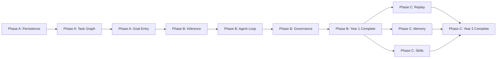

# AgentOS — Roadmap

Outcome-driven build plan aligned with the [future-state PRD](PRD.md). Phases are organized by **product pillars and Year 1/2 success criteria**, not infrastructure version numbers.

For current vs target status per pillar, see [GAP_ANALYSIS.md](GAP_ANALYSIS.md).

---

## Phase Overview

| Phase | Horizon | Outcome |
|-------|---------|---------|
| **Done** | v0.x – v2.1 | Foundation UI, orchestration shell, desktop bridge, real worktrees/commands |
| **A — Foundation** | Now → 3 months | Persistence, task graph engine, goal entry |
| **B — Year 1** | 3 → 12 months | Real agent loop, governance, merge approval, working app |
| **C — Year 2** | 12 → 24 months | Replay, memory, skills executor, scale |
| **Deferred** | Beyond 24 months | Enterprise, cloud runners, remote execution |

---

## Done — Foundation (v0.x through v2.1)

**Status:** Complete

What shipped:

- RuntimeEngine + OrchestratorRuntime dual-singleton architecture
- Event-driven state with React context subscriptions
- Full Observatory UI shell (orchestration 7-tab view, sessions, dashboard, command palette)
- Orchestration layer: plans, delegation chains, reasoning log, blockers, reviews, timeline
- Human override controls (takeover, inject, escalate)
- Tauri v2 desktop app with native folder picker
- Real git repo validation (`.git/HEAD` read)
- Real git worktree creation (desktop): `git worktree add` under `.agentos/worktrees/`
- Allowlisted command execution: `git status`, `git diff`, `npm test`, etc.
- Live git diff viewer in session detail
- Ollama health ping
- OSS readiness: onboarding, docs, CI, security policy, landing page

**Pillars partially addressed:** 4 (worktree create), 5 (timeline UI), 7 (governance UI), 8 (escalation modal), 9 (provider health), 14 (Tauri local), 15 (Observatory shell)

---

## Phase A — Foundation (Current → ~3 months)

**Status:** Current (Sprint 2 complete — TaskGraphEngine + projections)

**Goal:** Establish the task graph as source of truth and durable local storage. Replace disconnected mock data with a unified data layer.

### Sprint 1 — Local persistence (complete)

**Shipped:** SQLite store seam, Tauri-first dev workflow, boot initialization.

| What shipped | Where |
|--------------|-------|
| SQLite schema v1 (`projects`, `graph_nodes`, `graph_edges`, `events`, `sessions`) | `src-tauri/src/db/` |
| Tauri store IPC (13 commands: init, CRUD, append event) | `src-tauri/src/store_commands.rs` |
| TypeScript `LocalStore` + `getLocalStore()` factory | `src/runtime/store/` |
| Graph entity types (`Project`, `GraphNode`, `GraphEdge`, `StoredEvent`) | `src/types/graph.ts` |
| Tauri-first boot gate (`store_init` before Observatory renders) | `src/hooks/usePersistence.ts`, `src/App.tsx` |
| Storage diagnostics panel | Runtime → Connection tab |
| `LogsView` stub (wraps `RuntimeLogPanel`) | `src/components/logs/LogsView.tsx` |
| Default dev entry: `npm run dev` → Tauri; `npm run dev:web` → browser preview | `package.json`, `tauri.conf.json` |

**Behaviour today:**
- Desktop (`npm run dev`): opens native window, initializes `app_data_dir/agentos.db` on boot, writes a `system_event` on first launch to prove round-trip persistence
- Browser (`npm run dev:web`): in-memory fallback, dismissible banner; no SQLite
- Kanban and Plan views read from graph; sessions/reviews still mock

**Next sprint:** Goal entry flow; Dashboard/Session graph projections; orchestrator session hydration.

### Sprint 2 — TaskGraphEngine + projections (complete)

**Shipped:** Canonical graph engine, demo seed, Kanban/Plan projections, durable timeline.

| What shipped | Where |
|--------------|-------|
| `TaskGraphEngine` singleton (CRUD, executor, subscribe) | `src/runtime/taskGraphEngine.ts` |
| Dependency executor (ready / blocked nodes) | `src/runtime/graphExecutor.ts` |
| Demo graph seed from `mockPlanning` | `src/data/demoGraphSeed.ts` |
| Graph → Task / RuntimePlan projections | `src/runtime/graphProjections.ts` |
| Event store ↔ timeline mapping | `src/runtime/eventProjection.ts` |
| `TaskGraphContext` + `useGraphTasks` hook | `src/context/TaskGraphContext.tsx` |
| Kanban + Plan wired to graph | `TaskBoard.tsx`, `RuntimePlanView.tsx` |
| Timeline hydrated + dual-write from orchestrator | `orchestratorRuntime.ts` |
| In-memory `LocalStore` for `dev:web` | `memoryLocalStore.ts` |

### Deliverables

| Deliverable | Pillars | Status | Key work |
|-------------|---------|--------|----------|
| Local persistence | 14 | **Done (Sprint 1)** | SQLite via Tauri; schema + IPC + boot init |
| Task Graph Engine | 2 | **Done (Sprint 2)** | `TaskGraphEngine` + executor; demo seed |
| Append-only event log | 5 | **Done (Sprint 2)** | Timeline hydrated from store; `pushEvent` persists |
| Goal entry flow | 1, 15 | Upcoming | Natural language project description → triggers planner |
| PRD alignment docs | 15 | Ongoing | This doc set; README/Landing repositioning |
| Observatory fixes | 15 | Partial | Kanban + Plan on graph; Dashboard/Sessions still mock |

### Success criteria

- User enters a goal; system creates a persisted task graph — **upcoming** (demo seed only)
- Graph executor identifies ready vs blocked nodes — **done** (Runtime diagnostics + engine API)
- Timeline shows real events from local store (not mock timers) — **done** (hydrate + dual-write; simulation events persist)
- Page reload preserves project state — **partial** (graph + timeline persist; sessions still mock)

### Dependencies

None — this phase unblocks everything else.

---

## Phase B — Year 1 Success (~3 → 12 months)

**Status:** Upcoming

**Goal:** A developer can describe a project, supervise agents building it, review diffs, approve merges, and obtain a working application.

Maps to PRD Year 1 success criteria:

1. ✅ Describe project → Phase A goal entry
2. ✅ Generate plan → Planner agent + epics
3. ✅ Spawn specialized agents → Agent org + graph assignment
4. ✅ Watch work happen → Observatory wired to real events
5. ✅ Review diffs → Already partial (desktop diff); wire to graph nodes
6. ✅ Approve merges → Governance gates
7. ✅ Obtain working application → End-to-end loop

### Deliverables

| Deliverable | Pillars | Key work |
|-------------|---------|----------|
| Multi-model inference | 9 | Streaming LLM calls; role → model routing; token metering |
| Planner agent | 1, 3 | Goal → epics → tasks with acceptance criteria |
| Builder agent | 3, 4 | Graph node → worktree → implement → patch |
| Reviewer agent | 3, 8 | Audit patch; approve/reject; gate merge |
| Tester agent | 12 | Run tests; attach results to node; failure → new task |
| Worktree lifecycle | 4 | Create, track, archive, merge with approval |
| Governance modes | 7 | Manual / Assisted / Autonomous / Full Auto selector |
| Approval gates | 8 | Merge, dependency install, file delete — configurable per mode |
| Cost accounting | 13 | Real token costs per task/epic from provider responses |
| Mock → real migration | 15 | Incrementally replace `mock*` data with graph projections |

### Success criteria

- End-to-end: goal → plan → implement → test → review → merge approval → working code
- Developer supervises via Observatory; does not manually coordinate agents
- All actions logged; human can override at any point
- Assisted mode (default): autonomous implementation, merge requires approval

### Dependencies

Phase A complete (persistence + graph engine).

---

## Phase C — Year 2 Success (~12 → 24 months)

**Status:** Future

**Goal:** Maintain large repositories over months with replay, memory, and minimal supervision.

Maps to PRD Year 2 success criteria:

1. Multiple persistent agents across large repos
2. Continuous graph maintenance over months
3. Replay months of execution history
4. Delegate entire features
5. Resume projects from memory
6. Supervise rather than implement

### Deliverables

| Deliverable | Pillars | Key work |
|-------------|---------|----------|
| Replay engine | 6 | Record from event log; step-through UI; branch exploration |
| Agent memory | 11 | Per-agent local memory; cross-task recall; Memora integration API |
| Skills executor | 10 | Load SKILL.md-style skills; bind to agents at assignment |
| Observatory consolidation | 15 | Unified dashboard; graph-centric navigation; replay + memory panels |
| Scale hardening | 2, 3, 4 | Concurrent sessions; worktree cleanup; graph performance |
| MCP integration | 10 | External tools via skills framework |

### Success criteria

- Replay any feature's provenance chain end-to-end
- Agent remembers prior decisions when resuming a project
- Developer delegates a feature and returns days later to review outcome
- Skills extend agent capabilities without core OS changes

### Dependencies

Phase B complete (real agent loop + durable events).

---

## Explicitly Deferred (Beyond 24 Months)

These items appeared in earlier version-centric roadmaps but are **out of scope** for the 12–24 month horizon per PRD audience constraints:

| Former milestone | Reason deferred |
|------------------|-----------------|
| v3.0 Remote runner support | Violates local-first, solo-dev focus; adds enterprise complexity |
| v3.0 Cloud provider integrations | No cloud dependency is a design constraint |
| Enterprise multi-tenant | Audience is solo developers |
| Org admin / SSO / billing platform | Not an OS concern |
| Plugin sandbox runtime (v3.2) | Skills framework (Pillar 10) covers extensibility; full plugin OS deferred |

These may be revisited if community demand emerges, but they are not on the critical path to Year 1 or Year 2 success.

---

## Pillar → Phase Map

| Pillar | Phase A | Phase B | Phase C |
|--------|---------|---------|---------|
| 1 Project Planning | Goal entry, mock planner | Real planner agent | Continuous replanning |
| 2 Task Graph Engine | Engine + store + executor | Full integration | Scale, queries |
| 3 Agent Organization | Types/registry prep | Real agent loop | Persistent multi-agent |
| 4 Worktree Runtime | — | Full lifecycle + merge | Cleanup at scale |
| 5 Execution Timeline | Durable event log | Real agent events | Cross-session correlation |
| 6 Replay Engine | — | — | Full replay |
| 7 Human Governance | — | Governance modes | Audit + replay |
| 8 Approval Gates | — | Wired gates + merge | Custom gates |
| 9 Multi-Model Runtime | — | Inference + routing | Cost-aware routing |
| 10 Skills Framework | — | — | Executor + MCP |
| 11 Agent Memory | — | — | Memory + Memora |
| 12 Testing & Verification | — | Real tests on graph | Coverage gates |
| 13 Cost Accounting | — | Real metering | Budgets |
| 14 Local First | SQLite store ✓ (Sprint 1) | Orchestrator hydration | Offline daemon |
| 15 Agent Observatory | Fixes + graph projection | Real data binding | Full consolidation |

---

## Critical Path

---

## How to Read This Alongside the App Roadmap View

The in-app Roadmap view (`src/components/roadmap/RoadmapView.tsx`) mirrors this document via shared phase data in `src/data/roadmapPhases.ts`. When updating phases, edit the shared data file and sync this document.

---

## Related Documents

- [PRD.md](PRD.md) — full product vision and pillar definitions
- [GAP_ANALYSIS.md](GAP_ANALYSIS.md) — current implementation status per pillar
- [ARCHITECTURE.md](../ARCHITECTURE.md) — technical architecture (current + target)
